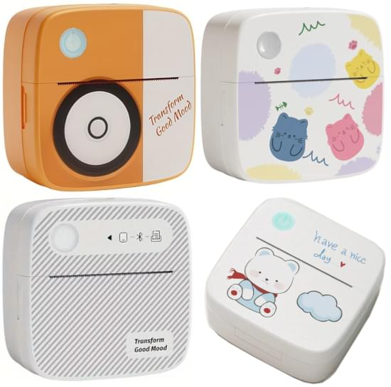

printer-driver-funnyprint
=========================

Linux CUPS driver for Xiqi/DOLEWA Bluetooth mini thermal printers supported by **FunnyPrint** application.

* Xiqi LX-D2
* Xiqi LX-D3
* DOLEWA D3 Mini Printer
* DOLEWA LX-D5
* "Transform good mood" / "Have a nice day" printer



## Installation

You'll need Python 3.8 or newer. Tested on Ubuntu 20.04, Ubuntu 22.04, Fedora 41.  

1. `git clone https://github.com/ValdikSS/printer-driver-funnyprint`
2. `cd printer-driver-funnyprint`
    - Debian/Ubuntu: `sudo apt build-dep . && dpkg-buildpackage -us -uc -nc && sudo apt install ../printer-driver-funnyprint_*_all.deb`
    - Other distributions: `sudo make install`
3. Power on the printer
4. Go to [http://127.0.0.1:631/admin](http://127.0.0.1:631/admin) CUPS web interface
5. Press "Add printer". You should see `Xiqi LX-D02(FunnyPrint) (Xiqi LX-D02)` or similar printer listed.
6. Continue adding the printer, selecting **Xiqi → Xiqi LX-D2** driver

## Uninstallation

Debian/Ubuntu:

`sudo apt remove printer-driver-funnyprint`

Other distributions:

`cd printer-driver-funnyprint && sudo make uninstall`

OR

```
sudo pip3 uninstall rastertofunnyprint
sudo rm /usr/lib/cups/backend/funnyprint /usr/share/cups/drv/funnyprint-xiqi.drv
```

## Usage

Use it as any regular printer, print from any application.  
Choose appropriate page size for your labels or images.

## Options

#### Skip blank lines

This driver has "roll" 58×999mm and 48×999mm page sizes. It is configured to cut all blank space from the printout if this page size is used by default, so you can print anything in roll mode without fearing of rolling out all the paper.  
Cutting blank space could be enabled for custom or all page sizes as well in your printing application in **Skip blank lines (top and bottom)** configuration option.

#### Dithering type

This option controls Ghostscript dithering used in `gstoraster` CUPS filter.  
This function requires [the patch](https://github.com/OpenPrinting/libcupsfilters/pull/92) to `gstoraster`.

Use `bi-level` for label printing if you have "fuzzy" text and/or barcode with the standard dithering algorithm.
